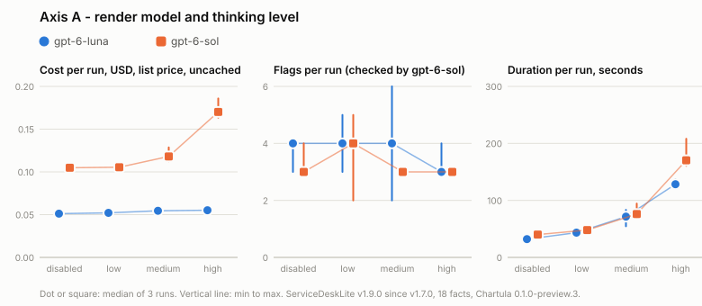
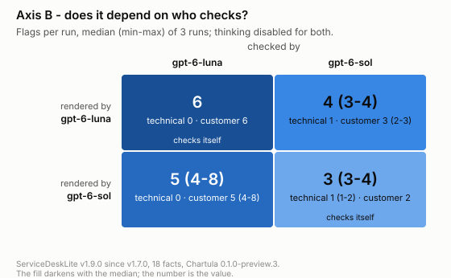

# Sweep statistics: servicedesklite-v1.9.0

Generated by `tools/sweep_stats.py report` from the run records alone; do not edit by hand.
Chartula: 0.1.0-preview.3+7620e6d95b62190d12f57ba345479b524674fea1.
Runs: 42 finished in 14 cells, 43 attempts.
Prices: `prices-2026-09-25.json`, https://developers.openai.com/api/docs/pricing, standard tier, as of 2026-09-25, USD per 1M tokens, list price.
Cost compares cells on *uncached* (every input token at the full rate); *billed* applies the cache as it fell.
Every figure is the median of a cell's finished runs, with min-max in brackets when they differ.

## Cells

| axis | cell | render | thinking | check | runs / attempts | cost uncached $ | cost billed $ | input tokens | output tokens | reasoning (render) | duration s | flags / run | technical | customer | not evaluated |
|---|---|---|---|---|---|---|---|---|---|---|---|---|---|---|---|
| A+B | `gpt-6-luna-disabled` | gpt-6-luna | disabled | checked by gpt-6-sol, disabled | 3 / 3 | 0.0512 (0.0510-0.0512) | 0.0493 (0.0491-0.0512) | 43,843 (43,823-44,008) | 1,893 (1,884-1,999) | 0 | 32 (30-35) | 4 (3-4) | 1 | 3 (2-3) | 0 |
| A+B | `gpt-6-sol-disabled` | gpt-6-sol | disabled | checked by gpt-6-sol, disabled | 3 / 3 | 0.1048 (0.1047-0.1055) | 0.0672 (0.0664-0.1048) | 43,751 (43,713-43,785) | 1,739 (1,717-1,791) | 0 | 40 (39-40) | 3 (3-4) | 1 (1-2) | 2 | 0 |
| A | `gpt-6-luna-low` | gpt-6-luna | low | checked by gpt-6-sol, disabled | 3 / 3 | 0.0521 (0.0511-0.0530) | 0.0502 (0.0492-0.0530) | 43,831 (43,732-43,845) | 2,683 (2,503-2,978) | 803 (644-926) | 43 (39-45) | 4 (3-5) | 1 | 3 (2-4) | 0 |
| A | `gpt-6-luna-medium` | gpt-6-luna | medium | checked by gpt-6-sol, disabled | 3 / 3 | 0.0545 (0.0515-0.0549) | 0.0526 (0.0515-0.0529) | 43,899 (43,798-43,906) | 6,937 (4,840-8,341) | 4,608 (3,074-6,103) | 72 (55-83) | 4 (2-6) | 1 (1-3) | 3 (1-3) | 0 |
| A | `gpt-6-luna-high` | gpt-6-luna | high | checked by gpt-6-sol, disabled | 3 / 3 | 0.0552 (0.0550-0.0574) | 0.0552 (0.0531-0.0555) | 43,938 (43,769-43,990) | 10,981 (10,307-13,391) | 8,879 (8,276-10,994) | 128 (124-137) | 3 (3-4) | 1 | 2 (2-3) | 0 |
| A | `gpt-6-sol-low` | gpt-6-sol | low | checked by gpt-6-sol, disabled | 3 / 3 | 0.1055 (0.1044-0.1066) | 0.0671 (0.0660-0.1066) | 43,728 (43,709-43,756) | 1,801 (1,694-1,907) | 69 (63-76) | 48 (47-51) | 4 (2-5) | 2 (1-3) | 2 (1-2) | 0 |
| A | `gpt-6-sol-medium` | gpt-6-sol | medium | checked by gpt-6-sol, disabled | 3 / 3 | 0.1181 (0.1124-0.1286) | 0.0903 (0.0798-0.1124) | 43,719 (43,711-43,729) | 3,069 (2,494-4,117) | 1,319 (581-2,167) | 76 (69-94) | 3 | 1 | 2 | 0 |
| A | `gpt-6-sol-high` | gpt-6-sol | high | checked by gpt-6-sol, disabled | 3 / 3 | 0.1701 (0.1635-0.1859) | 0.1476 (0.1318-0.1635) | 43,800 (43,764-43,827) | 8,260 (7,589-9,823) | 6,252 (5,510-7,680) | 170 (161-208) | 3 | 1 | 2 | 0 |
| B | `gpt-6-luna-checked-by-gpt-6-luna` | gpt-6-luna | disabled | checked by gpt-6-luna, disabled | 3 / 3 | 0.0054 (0.0054-0.0054) | 0.0035 (0.0034-0.0054) | 43,819 (43,783-43,865) | 1,970 (1,967-2,035) | 0 | 28 (27-31) | 6 | 0 | 6 | 0 |
| B | `gpt-6-sol-checked-by-gpt-6-luna` | gpt-6-sol | disabled | checked by gpt-6-luna, disabled | 3 / 3 | 0.0595 (0.0591-0.0598) | 0.0212 (0.0207-0.0598) | 43,750 (43,724-43,802) | 1,845 (1,818-2,246) | 0 | 43 (39-43) | 5 (4-8) | 0 | 5 (4-8) | 0 |
| side | `gpt-6-sol-disabled-no-thorough` | gpt-6-sol | disabled | no thorough check | 3 / 3 | 0.0572 (0.0570-0.0577) | 0.0189 (0.0187-0.0193) | 21,293 | 1,460 (1,444-1,508) | 0 | 34 (33-35) | 0 | 0 | 0 | 0 |
| side | `gpt-6-sol-disabled-title-only` | gpt-6-sol | disabled | checked by gpt-6-sol, disabled | 3 / 3 | 0.0230 (0.0230-0.0230) | 0.0196 (0.0196-0.0203) | 5,876 (5,836-5,878) | 1,123 (1,121-1,131) | 0 | 29 (26-30) | 1 (1-2) | 0 | 1 (1-2) | 0 |
| local | `qwen3-14b-checked-by-granite4.1-guardian-8b` | qwen3 | disabled | checked by granite, disabled | 3 / 4 | 0.0000 | 0.0000 | 44,653 (44,512-45,150) | 3,339 (1,902-12,603) | - | 219 (48-677) | 3 (0-4) | 1 (0-3) | 0 (0-3) | 0 |
| local | `qwen3-14b-checked-by-qwen3-14b` | qwen3 | disabled | checked by qwen3, disabled | 3 / 3 | 0.0000 | 0.0000 | 45,332 (44,938-45,963) | 3,013 (2,740-4,175) | - | 90 (71-97) | 17 (0-28) | 0 (0-17) | 0 (0-28) | 0 |

Side cells differ from `gpt-6-sol-disabled` in one setting each: thorough check off, or `factBase.depth: title-only`.
Local cells check on their own endpoint (`ThoroughCheckModel` in Chartula), so their flags come from another checker.

## Flags by pull request

In how many of a cell's finished runs each pull request was flagged at least once.

| PR | `gpt-6-luna-disabled` | `gpt-6-sol-disabled` | `gpt-6-luna-low` | `gpt-6-luna-medium` | `gpt-6-luna-high` | `gpt-6-sol-low` | `gpt-6-sol-medium` | `gpt-6-sol-high` | `gpt-6-luna-checked-by-gpt-6-luna` | `gpt-6-sol-checked-by-gpt-6-luna` | `gpt-6-sol-disabled-no-thorough` | `gpt-6-sol-disabled-title-only` | `qwen3-14b-checked-by-granite4.1-guardian-8b` | `qwen3-14b-checked-by-qwen3-14b` |
|---|---|---|---|---|---|---|---|---|---|---|---|---|---|---|
| #213 |  | 1 |  |  |  | 1 |  |  |  | 1 |  |  |  | 2 |
| #218 | 1 |  | 1 | 2 | 1 | 2 |  |  | 1 | 2 |  |  |  | 2 |
| #219 | 2 |  | 1 |  |  |  |  |  | 1 | 3 |  |  |  | 2 |
| #220 |  |  |  |  |  |  |  |  |  |  |  |  |  | 2 |
| #221 | 1 |  | 1 |  |  |  |  |  |  |  |  |  |  | 2 |
| #222 |  |  |  |  |  |  |  |  | 2 | 2 |  |  |  | 2 |
| #223 | 2 | 1 | 3 | 2 | 2 | 2 | 2 |  | 3 |  |  | 3 |  | 2 |
| #233 | 3 | 3 | 3 | 2 | 3 | 3 | 3 | 3 | 1 | 1 |  |  |  | 1 |
| #234 |  |  |  | 1 |  |  |  |  |  |  |  |  |  | 2 |
| #235 |  |  |  | 1 |  |  | 1 | 1 | 1 | 1 |  |  | 1 | 2 |
| #236 |  |  |  |  |  |  |  | 1 | 1 |  |  |  | 1 | 2 |
| #237 |  | 1 |  | 2 | 2 | 2 | 1 | 1 |  | 2 |  |  | 1 | 2 |
| #238 |  |  |  |  | 1 |  |  |  |  |  |  |  |  | 2 |
| #239 |  |  |  |  |  |  |  |  |  | 1 |  |  |  | 2 |
| #240 |  | 1 |  |  |  |  |  |  |  |  |  |  |  | 2 |
| #244 |  | 2 |  |  |  |  | 1 |  |  | 1 |  |  | 2 |  |
| #245 | 1 |  | 1 |  | 1 |  |  | 1 | 3 | 1 |  | 1 | 1 | 1 |
| no PR |  |  |  |  |  |  |  |  | 1 | 1 |  |  | 1 | 2 |

## Files

- `runs.csv`: one row per finished run, every figure the tables use.
- `flags.csv`: one row per flag, with its audience, pull request, checker and text.
- `cells.csv`: the per-cell medians and ranges.
- `flags-by-pr.csv`: the table above.
- `axis-a.svg`, `axis-b.svg`: the charts; hover a mark for its figures.

